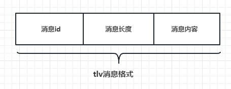

- [Cmake使用](#cmake使用)
- [网络编程基本流程](#网络编程基本流程)
- [使用boost的asio库进行一次简单的整体过程](#使用boost的asio库进行一次简单的整体过程)
  - [服务器端](#服务器端)
  - [客户端](#客户端)
- [socket的同步写](#socket的同步写)
  - [同步写write\_some](#同步写write_some)
  - [同步写send](#同步写send)
  - [asio中的write](#asio中的write)
- [socket的同步读](#socket的同步读)
  - [asio中的read\_some](#asio中的read_some)
  - [asio中的receive](#asio中的receive)
  - [asio中的read](#asio中的read)
  - [socket成员函数与asio中的公共函数区别](#socket成员函数与asio中的公共函数区别)
- [socket的异步读写api](#socket的异步读写api)
  - [数据缓存封装](#数据缓存封装)
  - [读写逻辑封装](#读写逻辑封装)
  - [封装一个简单的写逻辑](#封装一个简单的写逻辑)
  - [解决发送顺序问题](#解决发送顺序问题)
  - [封装异步读操作](#封装异步读操作)
- [封装一个简易的应答式异步服务器](#封装一个简易的应答式异步服务器)
  - [单个通信读写事件单元](#单个通信读写事件单元)
  - [管理所有连接的服务器类](#管理所有连接的服务器类)
- [封装为全双工](#封装为全双工)
- [处理粘包和字节序列](#处理粘包和字节序列)
  - [处理粘包](#处理粘包)


# Cmake使用
- 设置编译的时候最小的Cmake版本:$$
  - cmake_minimum_required(VERSION 3.10)
- 设置项目的名字
  - project("Test Code")
- 设置一个变量
  - set(HEAD_DIR_NAME "ClientAndSever")
- 添加子目录(内部必须包含CMakeLists.txt)
  - add_subdirectory(${HEAD_DIR_NAME})
- 添加可执行文件
  - add_executable(main main.cpp)
- 添加依赖的库
  - target_link_libraries(main PRIVATE ${HEAD_DIR_NAME}${LIB_END}  ws2_32)
- 设置包含的文件
  - file(GLOB SOURCES "src/*.cpp")
- 编译成第三方库的形式:STATIC静态库/SHARED动态库
  - add_library(${LIB_NAME} STATIC/ ${SOURCES})
- 包含头文件路径
  - target_include_directories(${LIB_NAME} PUBLIC ${CMAKE_CURRENT_SOURCE_DIR}/include)

# 网络编程基本流程
网络编程的分为两个部分客户端和服务器端口,分别对应了两个流程:
- 服务器:
  - socket  创建用于进行网络通信的套接字(socket)
  - bind    给创建出的套接字分配`ip`地址和`port`端口号
  - listen  监听这个端口是否有连接过来
  - accept  当有链接过来的时候建立一对一的tcp通信
  - read/write  进行数据的交换
- 客户端:
  - socket  创建用于进行网络通信的套接字(socket)
  - connect 通过ip地址和port号寻找服务器并发起连接请求
  - read/write  进行数据的交换

图形化的通信流程图


# 使用boost的asio库进行一次简单的整体过程
使用boost完成一次标准的流程[`ClientAndSever`](./code/ClientAndSever/),将父级别中的这个模块打开即可
## 服务器端
```cpp
int Sever_exe(const std::string &portNumber)
{
    using namespace boost::asio;
    //socket
    ip::address_v4 ip_address = ip::address_v4::any();
    auto port = std::stoul(portNumber);
    ip::tcp::endpoint ep(ip_address,port);
    //异步 I/O 操作的事件循环和调度器
    io_context ios;
    try
    {
        ip::tcp::acceptor accept(ios,ep.protocol());
        boost::system::error_code ec;
        //bind
        accept.bind(ep,ec);
        //listen
        accept.listen();
        //accept
        while(true)
        {
            ip::tcp::socket sock(ios);
            accept.accept(sock);
             std::cout
                <<"对方的ip地址:"
                <<sock.remote_endpoint().address().to_string()
                <<"\n"
                ;
        }
    }
    catch(boost::system::error_code& e)
    {
        std::cout<<"ErrorLog: " << e.what() << '\n';
        return e.value();
    }
    return 0;
}
```
## 客户端
```cpp
int Client_exe(const std::string &ip, const std::string &portNumber)
{
    using namespace boost::asio;

    ip::address_v4 ip_address =ip::make_address_v4(ip);
    auto port = std::stoul(portNumber);
    try
    {
        ip::tcp::endpoint ep(ip_address,port);
        io_context ios;
        //socket
        ip::tcp::socket sock(ios,ep.protocol());
        std::cout<<"连接服务器\n";
        //connect
        sock.connect(ep);
        sock.close();
        std::cout<<"断开连接服务器\n";
    }
    catch(boost::system::error_code& e)
    {
        std::cout<<"ErrorLog: " << e.what() << '\n';
        return e.value();
    }
    catch(boost::system::system_error& e)
    {
        std::cout<<"ErrorLog: " << e.what() << '\n';
        return e.code().value();
    }
    
    return 0;
}
```

# socket的同步写
## 同步写write_some
boost::asio的socket有write_some()的函数用于同步发送,以下是源码的写法
```cpp
template <typename ConstBufferSequence>
std::size_t write_some(const ConstBufferSequence& buffers)
{
  boost::system::error_code ec;
  std::size_t s = this->impl_.get_service().send(
      this->impl_.get_implementation(), buffers, 0, ec);
  boost::asio::detail::throw_error(ec, "write_some");
  return s;
}
```
boost提供了多种同步读写的api,`write_some()`每次可以向指定控件写入固定的字节数,如果缓冲区满了就写入一部分,并且返回`已经写入部分的长度`用于同步读写的主要函数之一._`适用于阻塞式的IO操作,在数据全部写完之前会阻塞线程`_

```cpp
void boost_asio_write_some(boost::ip::tcp::socket& s,const std::string& data)
{
  size_t send_length = 0;
  while(send_length!=data.length())
  {
    send_length = 
      end_length
      +
      s.write_some(
        boost::asio::buffer(
          data.c_str()+send_length
          ,
          (data.length()-send_length))
          );
  }
}
```
上述代码展示了如何使用`write_some()`将数据完整的发送出去,使用一个循环确保数据发送的数量和要发送的数据量一致
## 同步写send
asio中的同步发送send可以保证一次性发出所有的数据,不同于`write_some()`,`send()`函数会一次发送所有的数据不需要多次发送,但是`会阻塞线程`直到数据发送完成,源码如下
```cpp
template <typename ConstBufferSequence>
  std::size_t send(const ConstBufferSequence& buffers)
  {
    boost::system::error_code ec;
    std::size_t s = this->impl_.get_service().send(
        this->impl_.get_implementation(), buffers, 0, ec);
    boost::asio::detail::throw_error(ec, "send");
    return s;
  }
```

## asio中的write
类似于send函数asio还提供了一个`write()`用于一次性发送所有的数据,如果缓冲区满了就会`阻塞线程`直到发送完成
```cpp
boost::asio::write(socket, boost::asio::buffer(buff.c_str(), buff.length()));
```
# socket的同步读
## asio中的read_some
同步读和同步写类似提供了读取指定字节数的`read_some()`,这个函数会`阻塞线程直到读取到了指定字节数量的数据`,源码如下
```cpp
template <typename MutableBufferSequence>
  std::size_t read_some(const MutableBufferSequence& buffers)
  {
    boost::system::error_code ec;
    std::size_t s = this->impl_.get_service().receive(
        this->impl_.get_implementation(), buffers, 0, ec);
    boost::asio::detail::throw_error(ec, "read_some");
    return s;
  }
```

## asio中的receive
`receive()会阻塞到直到读取到至少1个字节的数据`,不同与read_some()一定要指定字节的数据但是使用这个需要考虑接受的数据大小
```cpp
template <typename MutableBufferSequence>
std::size_t receive(const MutableBufferSequence& buffers)
{
  boost::system::error_code ec;
  std::size_t s = this->impl_.get_service().receive(
      this->impl_.get_implementation(), buffers, 0, ec);
  boost::asio::detail::throw_error(ec, "receive");
  return s;
}
```

## asio中的read
与write类似asio提供了一个read函数
```cpp
boost::asio::read(socket, boost::asio::buffer(buff, SIZE));
```

## socket成员函数与asio中的公共函数区别
- 发送数据:
  - socket.send():
    - 成员函数用于将数据发送到对端
    - 返回实际发送的字节数,可能小于请求发送的数量
    - 是同步的,会阻塞线程
  - asio::send():
    - 提供的独立函数用于将数据写入到指定的流
    - 返回实际写入的字节大小,可能小于请求发送的数量
    - 是同步的,会阻塞线程
- 接受数据:
  - socket.read_some():
    - 成员函数用于接受对端发送的数据
    - 返回的实际接收到的字节数量可能小于发送的数量
    - 同步的会阻塞线程,直到有>=1字节数量的数据
  - asio::read():
    - 提供的独立函数用于将指定的流数据读取
    - 返回指定读取数据的数据,如果数据不够就等
    - 同步的阻塞线程,直到出现指定数量数据或者出现错误

# socket的异步读写api
使用异步读写API的时候通常需要两个部分：读写逻辑部分和数据缓存部分，数据缓冲部分是读写逻辑部分公用的逻辑

## 数据缓存封装
```cpp
extern const int RECVSIZE = 1024;
class MsgNode
{
public:
    MsgNode(const char* msg,int total_len);
    MsgNode(int total_len);
    ~MsgNode();
    const char* get_msg()const;
    int get_cur_index()const;
    int get_total()const;
    void append_data_offset(int length);
private:
    char* _msg;
    int _total_length;
    int _cur_length;
};


MsgNode::MsgNode(const char* msg,int total_len)
    :MsgNode(total_len)
{
    memcpy(_msg,msg,sizeof(char)*total_len);
}
MsgNode::MsgNode(int total_len)
    :_total_length(total_len)
    ,_cur_length(0)
{
    _msg = new char[total_len];
    memset(_msg,0,sizeof(char)*total_len);
}

MsgNode::~MsgNode()
{
    delete[] this->_msg;
}

const char *MsgNode::get_msg() const
{
    return _msg;
}

int MsgNode::get_cur_index() const
{
    return _cur_length;
}

int MsgNode::get_total() const
{
    return _total_length;
}

void MsgNode::append_data_offset(int length)
{
    this->_cur_length+=length;
}
```
封装了两个构造函数一个负责写已经有的数据,一个负责读取未定大小的数据

## 读写逻辑封装

## 封装一个简单的写逻辑
```cpp
class Session
{
public:
    Session(std::shared_ptr<boost::asio::ip::tcp::socket> socket);
    ~Session();
    void Connect(const boost::asio::ip::tcp::endpoint& ep);
    void WriteCallBackErr(const boost::system::error_code& ec,std::size_t bytes_transferred,std::shared_ptr<MsgNode> data);
    void WriteToSocketErr(const std::string& buf);
private:
    std::shared_ptr<MsgNode> _node;
    std::shared_ptr<boost::asio::ip::tcp::socket> _socket;
}


Session::Session(std::shared_ptr<boost::asio::ip::tcp::socket> socket)
    :_socket(socket)
    ,_send_panding(false)
    ,_read_panding(false)
{
}

Session::~Session()
{

}

void Session::Connect(const boost::asio::ip::tcp::endpoint &ep)
{
    _socket->connect(ep);
}

void Session::WriteCallBackErr(const boost::system::error_code &ec, std::size_t bytes_transferred, std::shared_ptr<MsgNode> data)
{
    _node->append_data_offset(bytes_transferred);
    if (_node->get_cur_index()!=_node->get_total())
    {
        this->_socket->async_write_some(
            boost::asio::buffer(
                _node->get_msg()+_node->get_cur_index()
                ,_node->get_total()-_node->get_cur_index()
            )
            ,std::bind(
                &Session::WriteCallBackErr
                ,this
                ,std::placeholders::_1
                ,std::placeholders::_2
                ,this->_node
            )
        );
    }
    
}

void Session::WriteToSocketErr(const std::string &buf)
{
    this->_node = std::make_shared<MsgNode>(buf.c_str(),buf.length());
    this->_socket->async_write_some(
        boost::asio::buffer(
            _node->get_msg()
            ,_node->get_total()
        )
        ,std::bind(
            &Session::WriteCallBackErr
            ,this
            ,std::placeholders::_1
            ,std::placeholders::_2
            ,this->_node
        )
    );

}
```
添加异步写操作的回调函数和调用函数,将数据传入调用函数`WriteToSocketErr`,根据传入的数据开辟一个数据缓冲类型,之后调用异步写操作的回调函数,async_write_some是异步写的函数，这个异步写函数有两个参数，第一个参数为ConstBufferSequence常引用类型的buffers，第二个参数为WriteToken类型，而WriteToken在上面定义了，是一个函数对象类型，返回值为void，参数为error_code和size_t，所以我们为了调用async_write_some函数也要传入一个符合WriteToken定义的函数，就是我们声明的WriteCallBackErr函数，前两个参数为WriteToken规定的参数，第三个参数为MsgNode的智能指针，这样通过智能指针保证我们发送的Node生命周期延长。
在WriteCallBackErr函数里判断如果已经发送的字节数没有达到要发送的总字节数，那么久更新节点已经发送的长度，然后计算剩余要发送的长度，如果有数据未发送完，再次调用async_write_some函数异步发送。但是这个函数并不能投入实际应用，因为async_write_some回调函数返回已发送的字节数可能并不是全部长度。比如TCP发送缓存区总大小为8字节，但是有3字节未发送(上一次未发送完)，这样剩余空间为5字节此时我们调用async_write_some发送hello world!实际发送的长度就是为5，也就是只发送了hello，剩余world!通过我们的回调继续发送。用户想发送数据的时候就调用WriteToSocketErr,或者循环调用WriteToSocketErr，很可能在一次没发送完数据还未调用回调函数时再次调用WriteToSocketErr，因为boost::asio封装的时epoll和iocp等多路复用模型，当写事件就绪后就发数据，发送的数据按照async_write_some调用的顺序发送，所以回调函数内调用的async_write_some可能并没有被及时调用


## 解决发送顺序问题
通过队列保证应用层的发送顺序。我们在Session中定义一个发送队列，然后重新定义正确的异步发送函数和回调处理
```cpp
class Session{
public:
    void WriteCallBack(const boost::system::error_code& ec, std::size_t bytes_transferred);
    void WriteToSocket(const std::string &buf);
private:
    std::queue<std::shared_ptr<MsgNode>> _send_queue;
    std::shared_ptr<asio::ip::tcp::socket> _socket;
    bool _send_pending;
};


void Session::WriteCallBack(const boost::system::error_code &ec, std::size_t bytes_transferred, std::shared_ptr<MsgNode> data)
{
    if (ec.value()!=0)
    {
        std::cout<<"error code:"<<ec.value()<<"\n";
        return;
    }
    auto& send_data = _send_queue.front();
    send_data->append_data_offset(bytes_transferred);
    if (send_data->get_cur_index()!=send_data->get_total())
    {
        this->_socket->async_write_some(
            boost::asio::buffer(send_data->get_msg()+send_data->get_cur_index(),send_data->get_total()-send_data->get_cur_index())
            ,std::bind(&Session::WriteCallBack,this,std::placeholders::_1,std::placeholders::_2
            )
        );
        return;
    }
    _send_queue.pop();
    if (_send_queue.empty())
    {
        this->_send_panding = false;
    }else
    {
        auto& send_data = _send_queue.front();
        this->_socket->async_write_some(
            boost::asio::buffer(send_data->get_msg(),send_data->get_total())
            ,std::bind(&Session::WriteCallBack,this,std::placeholders::_1,std::placeholders::_2)
        );
    }
    
}

void Session::WriteToSocket(const std::string &buf)
{
    _send_queue.emplace(std::make_shared<MsgNode>(boost::asio::buffer(buf.c_str(),buf.length())));
    if (this->_send_panding)
    {
        return;
    }
    this->_socket->async_write_some(
        boost::asio::buffer(
            buf.c_str(),buf.length()
        )
        ,std::bind(
                &Session::WriteCallBack
                ,this
                ,std::placeholders::_1
                ,std::placeholders::_2
        )
    );
    this->_send_panding = true;
}

```
定义了bool变量_send_pending，该变量为true表示一个节点还未发送完。
_send_queue用来缓存要发送的消息节点，是一个队列

async_write_some函数不能保证每次回调函数触发时发送的长度为要总长度，这样我们每次都要在回调函数判断发送数据是否完成，asio提供了一个更简单的发送函数async_send，这个函数在发送的长度未达到我们要求的长度时就不会触发回调，所以触发回调函数时要么时发送出错了要么是发送完成了,其内部的实现原理就是帮我们不断的调用async_write_some直到完成发送，所以async_send不能和async_write_some混合使用

```cpp

void Session::WriteAllCallBack(const boost::system::error_code &ec, std::size_t bytes_transferred, std::shared_ptr<MsgNode> data)
{
    if (ec.value()!=0)
    {
        std::cout<<"error code:"<<ec.value()<<"\n";
        return;
    }
    _send_queue.pop();
    if (_send_queue.empty())
    {
        this->_send_panding = false;
    }else
    {
        auto& send_data = _send_queue.front();
        this->_socket->async_send(boost::asio::buffer(send_data->get_msg(),send_data->get_total())
            ,std::bind(&Session::WriteAllCallBack,this,std::placeholders::_1,std::placeholders::_2)
    );
    }
    
}

void Session::WriteAllToSocked(const std::string &buf)
{
    this->_send_queue.emplace(std::make_shared<MsgNode>(buf.c_str(),buf.length()));
    if (this->_send_panding)
    {
        return;
    }
    this->_socket->async_send(boost::asio::buffer(buf.c_str(),buf.size()),std::bind(&Session::WriteAllCallBack,this,std::placeholders::_1,std::placeholders::_2));
    this->_send_panding = true;
}

```

## 封装异步读操作

异步读操作和异步的写操作类似同样又async_read_some和async_receive函数，前者触发的回调函数获取的读数据的长度可能会小于要求读取的总长度，后者触发的回调函数读取的数据长度等于读取的总长度。

```cpp
class Session {
public:
    void ReadToSocket();
    void ReadCallBack(const boost::system::error_code& ec, std::size_t bytes_transferred);
private:
    std::shared_ptr<asio::ip::tcp::socket> _socket;
    std::shared_ptr<MsgNode> _recv_node;
    bool _recv_pending;
};


void Session::ReadCallBack(const boost::system::error_code &ec, std::size_t bytes_transferred)
{
    if (ec.value()!=0)
    {
        std::cout<<"error code:"<<ec.value()<<"\n";
        return;
    }
    _read_node->append_data_offset(bytes_transferred);
    if (_read_node->get_cur_index()!=_read_node->get_total())
    {
        _socket->async_read_some(
            boost::asio::buffer(_read_node->get_msg()+_read_node->get_cur_index(),_read_node->get_total()-_read_node->get_cur_index())
            ,std::bind(&Session::ReadCallBack,this,std::placeholders::_1,std::placeholders::_2)
        );
        return;
    }
    _read_panding = false;
    //TODO:处理接收到的数据
    _read_node = nullptr;
}

void Session::ReadToSocket()
{
    if(_read_panding)
    {
        return;
    }
    _read_node = std::make_shared<MsgNode>(RECVSIZE);
    this->_socket->async_read_some(
        boost::asio::buffer(_read_node->get_msg(),_read_node->get_total())
        ,std::bind(&Session::ReadCallBack,this,std::placeholders::_1,std::placeholders::_2)
    );
    _read_panding = false;
    //TODO:处理接收到的数据
    _read_node = nullptr;
}
```

同样的异步读操作也有保证一次性读取完成的函数

```cpp

void Session::ReadAllCallBack(const boost::system::error_code &ec, std::size_t bytes_transferred)
{
    if (ec.value()!=0)
    {
        std::cout<<"error code:"<<ec.value();
        return;
    }
    _read_node->append_data_offset(bytes_transferred);

    _read_panding = false;
    //TODO:处理接收到的数据
    _read_node = nullptr;
}

void Session::ReadAllToSocket()
{
    if (_read_panding)
    {
        return;
    }
    _read_node = std::make_shared<MsgNode>(RECVSIZE);
    this->_socket->async_receive(boost::asio::buffer(_read_node->get_msg(),_read_node->get_total())
        ,std::bind(&Session::ReadAllCallBack,this,std::placeholders::_1,std::placeholders::_2)
    );
    _read_panding = true;
}
```

总结四种异步读写接口:
- async_send
  - 保证一次性写入完成内部自动封装了多次绑定async_write_some的操作
- async_write_some
  - 可能因为缓冲区的问题而出现一次性无法完成所有数据的写入
- async_read_some
  - 可能因为缓冲区的而无法一次性全部读出数据
- async_receive
  - 保证一次性读出完成内部封装了多次绑定async_read_some的操作

根据实际情况决定使用的方法

# 封装一个简易的应答式异步服务器

## 单个通信读写事件单元
不考虑粘包问题规定交换的数据是固定字节的格式,首先封装一个用于读写的`Session`
```cpp
class Session
{
public:
  Session(boost::asio::io_context& ioc);
  ~Session();
  void Strat();
  boost::asio::ip::tcp::socket& Socket();

private:
  void handle_read(const boost::system::error_code& ec,std::size_t bytes_transfered);
  void handle_write(const boost::system::error_const& ec);
  boost::asio::ip::tcp::socket _socket;
  enum{max_length = 1024}
  char _data[max_length];
}

Session(boost::asio::io_context& ioc)
  :_socket(ioc)
  {

  }
boost::asio::ip::tcp::socket& Socket()
{
  return _socket;
}
void Strat()
{
  memset(_data,0,sizeof(char)*max_length);
  _socket.async_read_some(boost:;asio::buffer(_data,max_length),std::bind(&Session::handle_read,this,std::placeholders::_1,std::placeholders::_2));
}
void handle_read(const boost::system::error_code& ec,std::size_t bytes_transfered)
{
  if(!ec)
  {
    std::cout<<data;
    boost::asio::async_wtire(_socket,boost::asio::buffer(_data,bytes_transfered),std::bind(&Session::handle_write,this,std::placeholders::_1));
  }
  else
  {
    delete this;
  }
}
void handle_write(const boost::system::error_const& ec)
{
  if(!ec)
  {
    memset(_data,0,max_length*sizeof(char));
    _socket.async_read_some(boost::asio::buffer(_data,max_length),std::bind(&Session::handle_read,this,std::placeholders::_1));
  }else
  {
    delete this;
  }
}
```
使用_data接受固定长度的数据
使用_socket为单独处理客户端读写的socket
使用handle_read和handle_write作为读写的回调函数

首先明确了使用固定字节数量的数据进行交换,所以实现的Start()函数使用了`async_read_some()`读取固定字节数量的数据
当数据发送过来的时候触发回调函数,将数据读取出来并且调用异步写函数`async_write()`绑定异步写结束的回调函数`handle_write()`
当数据发送完毕的时候会触发写回调函数,这个时候再将读取数据的回调函数绑定回去完成一次数据的循环

## 管理所有连接的服务器类
```cpp
class Server
{
public:
  Server(boost::asio::io_context& ioc,short port);
private:
  void start_accept();
  void handle_accept(Session* new_session,const boost::system::error_code& ec);
  boost::asio::io_context& _ioc;
  boost::asio::ip::tcp::acceptor _acceptor;
}

Server(boost::asio::io_context& ioc,short port)
  :_ioc(ioc)
  ,_acceptor(ioc,boost::asio::ip::tcp::socket(boost::asio::ip::tcp::v4(),port))
{
  start_accept();
}
void start_accept()
{
  Session new_session = new Session(_ioc);
  _acceptor.async_accept(new_session->Socket(),this,std::bing(&Server::handle_accept,this,new_session,std::placeholders::_1));
}
void handle_accept(session* new_session,const boost::system::error_code& ec)
{
  if(!ec)
  {
    new_session->Start();
  }
  else
  {
    delete new_session;
  }
}
```
使用一个关联上下的类创建出这个服务器管理类,使用`start_accept()`将要接受连接的acceptor绑定到服务器上,内部就是将对应的socket描述符绑定到iocp模型上,当回调函数触发的时候socket已经和客户端建立好连接了
之后在回调函数中开启socket的事件

# 封装为全双工
实际开发过程中的服务器采用的是全双工通信，服务器一直接受客户端的发来的信息同时也可以随时讲数据发送给对方：
- 单工
  - 数据单向单线流通
- 半双工
  - 数据双向单线流通
- 全双工
  - 数据双向双线流通

将之前的半双工通信服务中的读写数据回调进行改绑，读就一直读、写就一直写
```cpp
void Session::handle_read(const boost::system::error_code& ec,std::size_t bytes_transfered)
{
    if (!ec)
    {
        std::cout<<"read data:"<<_read_data->get_msg()<<"\n";
        send(_read_data->get_msg(),_read_data->get_total_length());
        _read_data->clear();
        _socket.async_read_some(
            boost::asio::buffer(_read_data->get_msg(),_read_data->get_total_length())
            ,
            std::bind(&Session::handle_read,shared_from_this(),std::placeholders::_1,std::placeholders::_2)
        );
    }
    else
    {
        std::cout<<"read error code : "<<ec.value();
        _parent->clear_session(_uuid);
    }
}
void Session::handle_write(const boost::system::error_code& ec)
{
    if (!ec)
    {
        if (!_data_que.empty())
        {
            _start_send_que_data();
        }else
        {
            std::cout <<"send queue is empty \n";
        }
    }
    else
    {
        std::cout<<"write error code : "<<ec.value();
        _parent->clear_session(_uuid);
    }
    
}
```
# 处理粘包和字节序列
粘包是服务器非常常见的现象当客户端发送多个数据包给服务器的时候底层的TCP接收缓冲区将多个包粘连在一起

客户端发送了两次`Hello Word!`给服务器但是服务器将两个包的数据粘连在一起了,出现的原因:
TCP底层是面向字节流的只能保证发送顺序和准确性,字节流以字节为单位发送N个字节给服务器,N取决于当前客户端缓冲区是否有空间,这个空间不保证一次性发送完成N个字节可能拆分为多次发送
## 处理粘包
处理粘包的方式主要采用规定一个数据包的格式的方式,这个过程`切包`,常用的协议是tlv协议(消息id+消息长度+消息内容)

处理tlv协议的方式
```cpp

if(ec)
{
    已经使用的数据长度
    copy_length = 0;
    while(接收的数据长度还有)
    {
        if(没有解析数据头部)
        {
            if(小于规定的头部字节长度)
            {
                将数据放到头部信息，然后继续读取
                return;
            }
            将数据放到头部数据中`注意上次是否有存一部分进去`
            if(数据长度超过了协议规定长度)
            {
                数据作废,错误处理
                return;
            }
            
            if(接收的数据小于数据长度)
            {
                将已经解析头变为true`head_parse`;
                将数据全部放入消息体接收中
                继续读取
                return;
            }
            将接收数据中需要部分拼入数据体中

            将解析头变为false`head_parse`
            if(没有剩余接收数据)
            {
                继续接收新的数据;
                return;
            }
            continue;
        }
        上次的数据不是整体的数据体这次数据是`上次的尾部+[可能还有新数据头部]`
        if(接收的数据比剩下需要的数据少)
        {
            拼入接收体
            继续接收
            return;
        }
        将数据拷贝需要的部分到接收数据体中
        将已经解析头变为true`head_parse`;
        if(已经使用完全部数据了)
        {
            继续接收数据
            return;
        }
        continue;
    }
}
else
{
    error process;
}
```
整体流程如下图

## 字节序
在计算机网络中，由于不同的计算机使用的 CPU 架构和字节顺序可能不同，因此在传输数据时需要对数据的字节序进行统一，以保证数据能够正常传输和解析。这就是网络字节序的作用。

具体来说，计算机内部存储数据的方式有两种：大端序（Big-Endian）和小端序（Little-Endian）。在大端序中，高位字节存储在低地址处，而低位字节存储在高地址处；在小端序中，高位字节存储在高地址处，而低位字节存储在低地址处。

在网络通信过程中，通常使用的是大端序。这是因为早期的网络硬件大多采用了 Motorola 处理器，而 Motorola 处理器使用的是大端序。此外，大多数网络协议规定了网络字节序必须为大端序。

因此，在进行网络编程时，需要将主机字节序转换为网络字节序，也就是将数据从本地字节序转换为大端序。可以使用诸如 htonl、htons、ntohl 和 ntohs 等函数来实现字节序转换操作。

综上所述，网络字节序的主要作用是统一不同计算机间的数据表示方式，以保证数据在网络中的正确传输和解析。